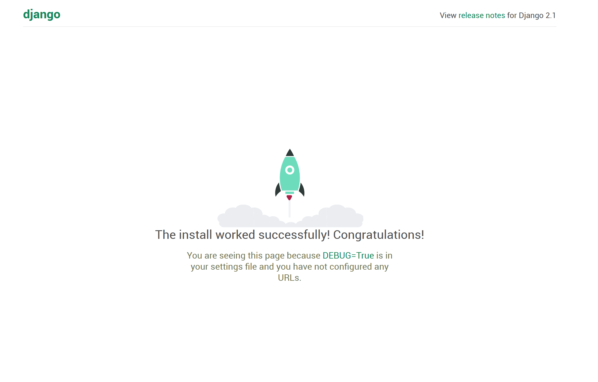

# Guia de como Hacer un ToDo List :memo:
Este fue uno de los primeros proyectos que hice para probar que tanto había aprendido de Django después de tomar el curso en línea que viene en la página
oficial de Django.

Lo primero que hice fue crear un ambiente virtual especifico para el proyecto el cual llame `todo-django`. Para esto solo es necesario ejecutar los siguientes comandos:

```bash
mkvirtualenv todo-django
workon todo-django
```

En caso de que no tengas instalado Django, solamente ejecuta el comando `pip install django` para ya tenerlo.

## Iniciando el Proyecto
Para iniciar el proyecto primero nos debemos de encontrar en la carpeta donde queremos que esté todo nuestro código y ejecutamos el comando `django-admin startproject TodoList` esto nos va a crear una carpeta llamada TodoList donde vivrá el código de nuestro proyecto.

Entonces nos vamos a posicionar dentro de nuestro proyecto y creamos una aplicación que utilizaremos dentro de este proyecto. Para esto usamos `django-admin startapp TodoListApp`. Revisemos que todo esta configurado correctamente en este punto corriendo `manage.py runserver` y abrimos nuestro navegador en http://127.0.0.1:8000/ . Si todo esta bien deberemos de ver una pagina que nos dice que todo se ha instalado de manera correcta.



## Configuraciones iniciales

Lo primero que vamos a hacer es agregar nuestra aplicacion a la lista de aplicaciones del projecto en Django. Para esto vamos al archivo `settings.py` y agregamos el nombre de nuestra aplicacion en la seccion de defincion de aplicaciones. Al final debe de quedar algo así:

```python
INSTALLED_APPS = [
    'django.contrib.admin',
    'django.contrib.auth',
    'django.contrib.contenttypes',
    'django.contrib.sessions',
    'django.contrib.messages',
    'django.contrib.staticfiles',
    'TodoListApp',
]
```